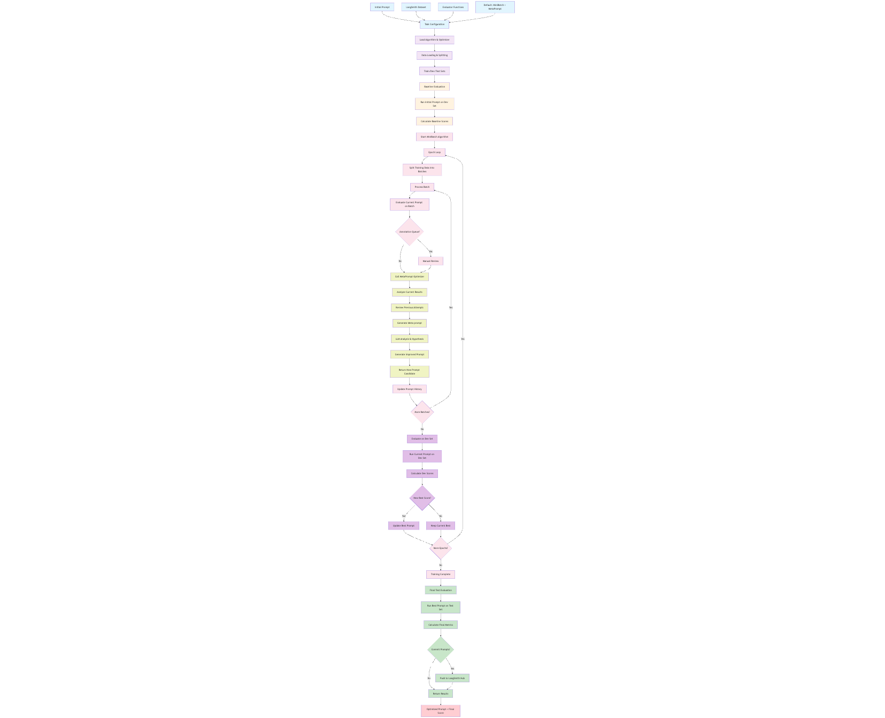

# Promptim

## Overview
The promptim library is a sophisticated prompt optimization framework built by LangChain that uses various algorithms and optimizers to systematically improve prompts through iterative evaluation and refinement.


## Flow Diagram


## Detailed Analysis

### Phase 1: Initialization
1. **Task Setup**: Load task configuration including initial prompt, dataset, evaluators
2. **Data Loading**: Split dataset into train/dev/test sets from LangSmith
3. **Component Initialization**: Initialize trainer, algorithm, and optimizer based on config

### Phase 2: Baseline Evaluation
1. **Initial Assessment**: Run initial prompt on development set
2. **Score Calculation**: Apply evaluator functions to get baseline metrics
3. **Experiment Tracking**: Log baseline results to LangSmith for comparison

### Phase 3: Algorithm-Specific Optimization (User Chooses ONE)

#### MiniBatch Algorithm (Default):
1. **Epoch Loop**: Process data in mini-batches over multiple epochs
2. **Batch Processing**: Take small subsets of training data
3. **Optimizer Call**: Call the selected optimizer (MetaPrompt/FewShot/etc.) to improve prompt
4. **Dev Evaluation**: Test improved prompt on development set
5. **Iteration**: Continue until all epochs completed

#### MIPRO Algorithm:
1. **Few-shot Synthesis**: Generate synthetic examples using teacher model
2. **Instruction Generation**: Create multiple instruction candidates
3. **Hyperparameter Optimization**: Use TPE (Tree-structured Parzen Estimator) to search optimal combinations
4. **Evaluation**: Test each configuration on development set

#### PhaseEvo Algorithm:
1. **Population Initialization**: Start with initial prompt(s) as population
2. **Phase Execution**: Run through curriculum of mutation strategies:
   - Lamarckian: Direct improvement through feedback
   - Semantic: Meaning-preserving variations
   - Gradient: Score-based optimization
   - EDA: Estimation of Distribution Algorithm
   - Crossover: Combining successful prompts
3. **Selection**: Keep best performing variants

### Phase 4: Prompt Improvement (Optimizers)

#### MetaPrompt Optimizer:
1. **Result Analysis**: Format current performance results
2. **Historical Context**: Include previous failed attempts
3. **Meta-prompting**: Use specialized LLM to analyze and hypothesize improvements
4. **Prompt Generation**: Generate improved prompt based on analysis

#### FewShot Optimizer:
1. **Performance Analysis**: Identify patterns in success/failure
2. **Example Selection**: Choose representative examples
3. **Template Integration**: Add examples to prompt structure

### Phase 5: Evaluation & Iteration
1. **Candidate Testing**: Evaluate new prompt candidates on dev set
2. **Score Comparison**: Compare against current best performance
3. **Convergence Check**: Determine if optimization should continue
4. **Result Logging**: Track all experiments in LangSmith

### Phase 6: Final Steps
1. **Test Evaluation**: Run final prompt on held-out test set
2. **Metric Calculation**: Compute final performance statistics
3. **Prompt Deployment**: Optionally commit to LangSmith Hub
4. **Result Return**: Provide optimized prompt and performance metrics


# Complete Reference: All Available Algorithms and Optimizers

## Available Algorithms

### 1. MiniBatch Algorithm (Default)
**File**: `algorithms/minibatch.py`
**Purpose**: Classic epoch-based training that processes data in mini-batches
**Configuration**:
```json
{
  "algorithm": {
    "kind": "minibatch",
    "batch_size": 40,
    "epochs": 5,
    "train_size": null,
    "debug": false,
    "max_score": 1.0
  }
}
```

**How it works**:
1. **Epoch Loop**: Runs for specified number of epochs
2. **Batch Processing**: Splits training data into mini-batches
3. **Sequential Optimization**: Processes each batch sequentially
4. **Dev Evaluation**: Evaluates on development set after each epoch
5. **Best Tracking**: Keeps track of best performing prompt

**Best for**: Standard prompt optimization with controlled batch processing

### 2. MIPRO Algorithm
**File**: `algorithms/mipro.py`
**Purpose**: Multi-step Instruction and few-shot Prompt Optimization
**Configuration**:
```json
{
  "algorithm": {
    "kind": "mipro",
    "max_bootstrapped_examples": 4,
    "max_labeled_examples": 4,
    "num_trials": 30,
    "minibatch": true,
    "minibatch_size": 50,
    "num_instruction_candidates": 10,
    "max_errors": 10,
    "seed": 42
  }
}
```

**How it works**:
1. **Few-shot Synthesis**: Generates synthetic examples using teacher model
2. **Instruction Generation**: Creates multiple instruction candidates
3. **TPE Optimization**: Uses Tree-structured Parzen Estimator for hyperparameter search
4. **Combination Testing**: Tests different combinations of instructions and examples
5. **Best Selection**: Returns optimal prompt configuration

**Best for**: Complex tasks requiring few-shot examples and instruction optimization

### 3. PhaseEvo Algorithm
**File**: `algorithms/phaseevo/algo.py`
**Purpose**: Evolutionary optimization with multiple mutation phases
**Configuration**:
```json
{
  "algorithm": {
    "kind": "phaseevo",
    "phases": [
      {"mutation": "lamarckian", "max_attempts": 1, "population_limit": 15},
      {"mutation": "semantic", "max_attempts": 1, "population_limit": 15},
      {"mutation": "gradient", "max_attempts": 4, "improvement_threshold": 1.0},
      {"mutation": "eda-index"},
      {"mutation": "crossover-distinct"},
      {"mutation": "gradient", "max_attempts": 2, "improvement_threshold": 1.0},
      {"mutation": "semantic"}
    ]
  }
}
```

**How it works**:
1. **Population Initialization**: Starts with initial prompt(s) as population
2. **Phase Execution**: Runs through curriculum of mutation strategies:
   - **Lamarckian**: Direct improvement through feedback
   - **Semantic**: Meaning-preserving variations
   - **Gradient**: Score-based optimization
   - **EDA**: Estimation of Distribution Algorithm
   - **Crossover**: Combining successful prompts
3. **Selection & Survival**: Keeps best performing variants
4. **Fitness Tracking**: Monitors population fitness over time

**Best for**: Exploratory optimization with diverse prompt variations

## Available Optimizers

### 1. MetaPrompt Optimizer (Default)
**File**: `optimizers/metaprompt.py`
**Purpose**: Uses LLM to analyze results and generate improved prompts
**Configuration**:
```json
{
  "optimizer": {
    "kind": "metaprompt",
    "model": {"model": "claude-3-5-sonnet-20241022"},
    "meta_prompt": "custom_meta_prompt_string"
  }
}
```

**How it works**:
1. **Result Analysis**: Formats current performance results
2. **Historical Context**: Includes previous failed attempts
3. **Meta-prompting**: Uses specialized LLM prompt to analyze failures
4. **Hypothesis Generation**: Creates hypothesis about what improvements to make
5. **Prompt Generation**: Generates improved prompt based on analysis
6. **Variable Validation**: Ensures all required variables are preserved

**Best for**: General-purpose optimization with intelligent analysis

### 2. FewShot Optimizer
**File**: `optimizers/fewshot.py`
**Purpose**: Optimizes prompt by selecting optimal few-shot examples
**Configuration**:
```json
{
  "optimizer": {
    "kind": "fewshot",
    "max_examples": 50,
    "n_trials": 5,
    "minibatch_size": 10
  }
}
```

**How it works**:
1. **Example Pool**: Creates pool of available training examples
2. **TPE Optimization**: Uses Tree-structured Parzen Estimator to select examples
3. **Combination Testing**: Tests different combinations of examples
4. **Score Evaluation**: Evaluates each combination on validation set
5. **Best Selection**: Returns prompt with optimal example combination

**Best for**: Tasks where few-shot examples significantly improve performance

### 3. FeedbackGuided Optimizer
**File**: `optimizers/feedback_guided.py`
**Purpose**: Focuses on improving specific failure cases
**Configuration**:
```json
{
  "optimizer": {
    "kind": "feedback_guided",
    "score_threshold": 0.8,
    "max_batch_size": 20,
    "recommendation_prompt": "custom_recommendation_prompt"
  }
}
```

**How it works**:
1. **Failure Identification**: Identifies examples scoring below threshold
2. **Targeted Analysis**: Analyzes each failing example individually
3. **Recommendation Generation**: Creates specific recommendations for improvements
4. **Consolidation**: Combines recommendations into actionable feedback
5. **Meta-prompt Application**: Uses consolidated feedback to improve prompt

**Best for**: Addressing specific failure patterns and edge cases

### 4. Debate Optimizer (Experimental)
**Purpose**: Uses multi-agent debate to identify and fix prompt vulnerabilities

**How it works**:
1. **Vulnerability Identification**: Identifies potential prompt weaknesses
2. **Defense Proposal**: Proposes multiple defense strategies
3. **Multi-agent Debate**: Conducts debate between different perspectives
4. **Consensus Building**: Builds consensus on best improvements
5. **Robustness Testing**: Tests improved prompt for robustness

**Best for**: Security-critical applications requiring robust prompts
